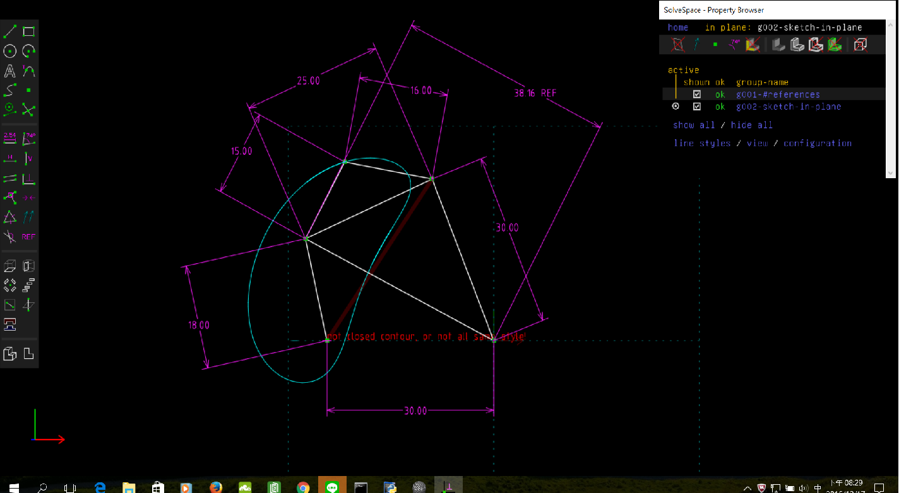

Title: Week 10
Date: 2016-11-18 20:00
Category: Misc
Tags: Solvespace
Author: 40423250

上課內容

<!-- PELICAN_END_SUMMARY -->

有關 Solvespace 機構模擬功能介紹, 與 Python3 及 Brython 程式驗證

路徑圖

將所得到的點座標 .csv 以 Excel 畫圖。路徑圖

心得

我這次做也出現了許多問題。但跟組員討論後也解決了問題，看來團隊的合作遠重要於個人能力。

